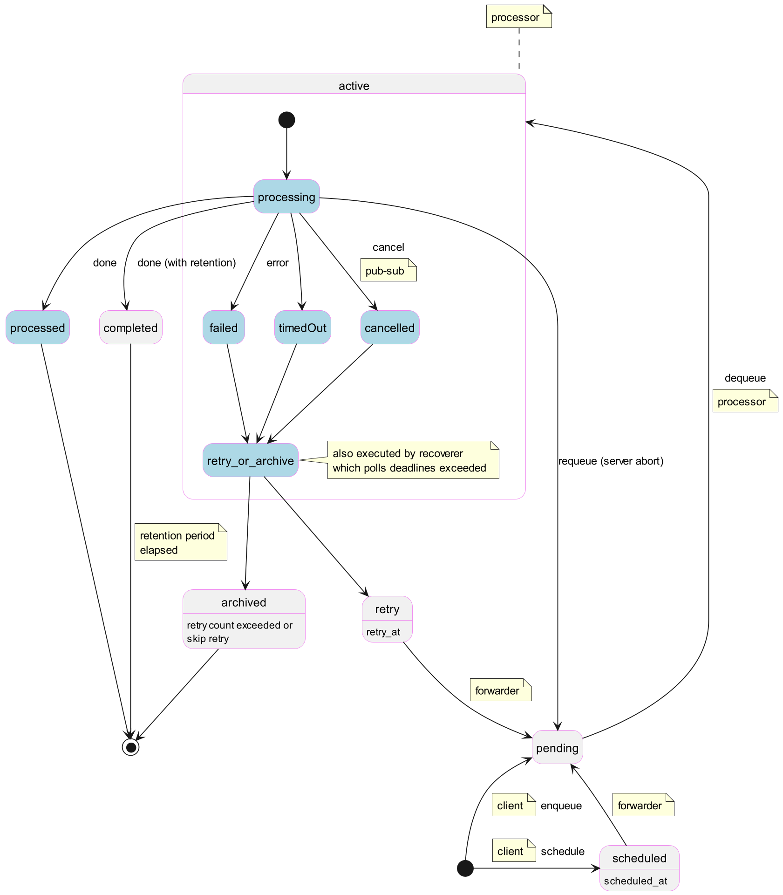

# Asynq

Asynq is a Go library for queueing tasks and processing them asynchronously with workers. 

Highlevel overview of how Asynq works:

   * Client puts tasks on a queue
   * Server pulls tasks off queues and starts a worker goroutine for each task
   * Tasks are processed concurrently by multiple workers

## Tasks state 

color legend

* gray: actual asynq states reflected in the DB of the broker
* lightblue: internal states not reflected in the DB of the broker



### Task handler

A task handler consists in a single function that returns an error.

```
type Handler interface {
	ProcessTask(context.Context, *Task) error
}
```

**Returned value**

After a successful processing the handler returns `nil`: the processor marks the task as `processed` or `completed`, as 
defined with the enqueue options. 

The returned error can have the special values below:  

* `TaskCanceled`: tells the processor that the task has been canceled, and to not retry and archive the task.
* `SkipRetry`: tells the processor to not retry and archive the task.
* `AsynchronousTask`: see below **Asynchronous Tasks**.
* `TaskTransitionDone`: the task was transitioned to another queue. See below **using queues as state**.

Other errors: the task is failed and will be retried or archived as configured when enqueued.

**Task interface**
    
During processing the handler has access to the following functions on `Task`:

```
	// Type returns the type of the task.
	Type() string

	// Payload returns the payload of the task as provided when enqueued.
	Payload() []byte

	// Result returns the result of the task.
	// Although usually nil (for regular tasks), the value might be the result of
	// the execution in another queue after the task was transitioned.
	Result() []byte

	// ResultWriter returns a pointer to the ResultWriter associated with the task.
	//
	// Only the tasks passed to Handler.ProcessTask have a valid ResultWriter pointer.
	ResultWriter() *ResultWriter

	// AsyncProcessor returns the AsyncProcessor associated with the task.
	//
	// Only the tasks passed to Handler.ProcessTask have a valid AsyncProcessor.
	AsyncProcessor() AsyncProcessor

	// CallAfter enables task processing to schedule execution of a function after the
	// task execution. The function is guaranteed to be called once the task state has
	// changed in the broker database.
	//
	// string: task id
	// error:  the error returned by task execution.
	// bool:   indicates if the error - if not nil - was considered as an actual error
	CallAfter(fn func(string, error, bool))
```

**ResultWriter** allows the handler to write result and has the following interface:

```
	// Write writes the given data as a result of the task the ResultWriter is associated with.
	Write(data []byte) (n int, err error)

	// TaskID returns the ID of the task the ResultWriter is associated with.
	TaskID() string
```

**AsyncProcessor** is the interface provided to active tasks.

* `TransitionToQueue` allow a (regular/synchronous) task to move the execution to another queue.
* The `TaskXX` functions are provided to asynchronous tasks to allow them to signal termination of their execution.<br/>
  Only the first call to any of these functions update the task status; all subsequent calls have no effect and return an error.<br/>
  These functions must only be called asynchronously after the handler returned error `AsynchronousTask`.
   * `TaskCompleted`: the tasks completed successfully
   * `TaskFailed`: the task failed
   * `TaskTransition` enqueues the task to another queue

```
type AsyncProcessor interface {
	// TaskCompleted indicates that the task has completed successfully.
	// The returned error is nil or TaskTransitionAlreadyDone
	TaskCompleted() error

	// TaskFailed indicates that the task has failed, with the given error.
	// The returned error is nil or TaskTransitionAlreadyDone
	TaskFailed(err error) error

	// TaskTransition moves the task to a new queue and send a TaskTransitionDone as a result of execution.
	// The returned error is nil or TaskTransitionAlreadyDone
	TaskTransition(newQueue, typename string, opts ...Option) error

	// TransitionToQueue moves the executing 'active' task to a new queue.
	// After a successful call:
	// - the task is either in pending or scheduled state in newQueue.
	// - the function returns the new state AND error TaskTransitionDone
	// otherwise it returns zero and the error.
	// The returned error should always be returned as the result of the task execution.
	TransitionToQueue(newQueue, typename string, opts ...Option) (TaskState, error)
}
```

### Asynchronous Tasks

Asynchronous tasks are long processing tasks: instead of continuing their execution on the go-routine
that invoked the task handler, they return the error `AsynchronousTask` to signal their execution will continue
outside the go-routine. 

The execution code must keep a reference on the task instance and later call one of the `TaskXX` functions
provided on the `AsyncProcessor` to terminate execution of the task.

## Queues

Queues are conceptually a list of queue names, each queue being associated with a priority.
Additionally, the `Queues` interface allows the processor for handling priorities in a strict or lenient fashion.  

The default implementation of `Queues` is `QueuesConfig` and may be updated at runtime.
This allows the server to be flexible on what queues are handled.

### using queues as state

In the imaginary application below, a parcel order has to be prepared, then delivered.


The parcel states can be represented using queues:

* the `prepare` queue handles the preparation. 
* the `deliver` queue handles the delivery

After the 'prepare' handler has finished with the parcel preparation, it may enqueue the parcel to the delivery queue.

To do so, the 'prepare' handler ends its execution by just calling `TransitionToQueue` (or `TaskTransition` if asynchronous):

```
func h(ctx context.Context, t *Task) error {

	// ... do something
	
	asyncProc := t.AsyncProcessor()
	_, err := asyncProc.TransitionToQueue("delivery_queue", "delivery", opts...)
	return err
}
```


## Server components

The asynq server work is made by several components:

| component     | description                                                                                                        |
|---------------|--------------------------------------------------------------------------------------------------------------------|
| broker        | access to storage (rqlite, sqlite, redis)                                                                          |
| processor     | poll queues and process tasks                                                                                      |
| forwarder     | moves scheduled and retry tasks to pending state                                                                   |
| syncer        | queues up failed requests to the broker and retry them to sync state between the background process and the broker |
| heartbeater   | writes process info periodically to the broker                                                                     |
| subscriber    | subscribes to the broker for notifications of canceled tasks                                                       |
| recoverer     | send active tasks with exceeded dead lines to retry or archive                                                     |
| healthchecker | notifies user components of health state                                                                           |
| janitor       | deletes expired completed tasks                                                                                    |


**Components intervals and actions.**<br>
Names of interval are those found in a server configuration.

* server
   * configurable interval: `ShutdownTimeout` 
* processor     
   * configurable interval: `ProcessorEmptyQSleep`
   * actions:
      * broker.Dequeue
      * broker.Requeue
      * broker.MarkAsComplete
      * broker.Done
      * broker.Retry
      * broker.Archive
* forwarder      
   * configurable interval: `ForwarderInterval`
   * action: broker.ForwardIfReady              
* syncer        
   * configurable interval: `SyncerInterval`                                                       
   * action: receives failed requests from the processor and retries them 
* heartbeater   
   * configurable interval: `HeartBeaterInterval`               
   * action: broker.WriteServerState            
* subscriber    
   * configurable intervals: 
      * `SubscriberRetryTimeout`
      * `PubsubPollingInterval` - for (r/s)qlite **on client config**                                     
   * action: broker.CancelationPubSub           
* recoverer      
   * configurable intervals: 
      * `RecovererInterval`
      * `RecovererExpiration`
   * note: at each `RecovererInterval`, evaluates tasks that have expired `RecovererExpiration` seconds ago or earlier
   * action: broker.ListDeadlineExceeded then calls broker.Retry or broker.Archive
* healthchecker 
   * configurable interval: `HealthCheckInterval`
   * action: broker.ping  
   * callback via `HealthCheckFunc` defined in server config  
* janitor       
   * configurable interval: `JanitorInterval`
   * action: broker.DeleteExpiredCompletedTasks 


